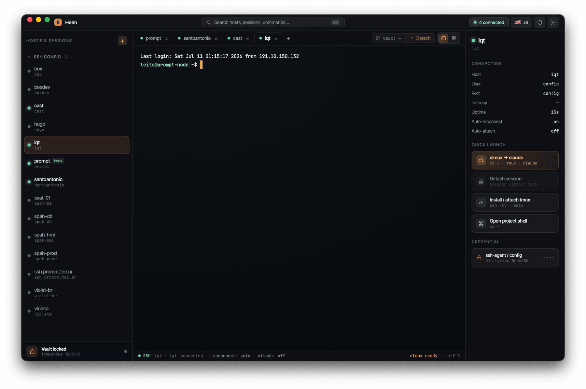
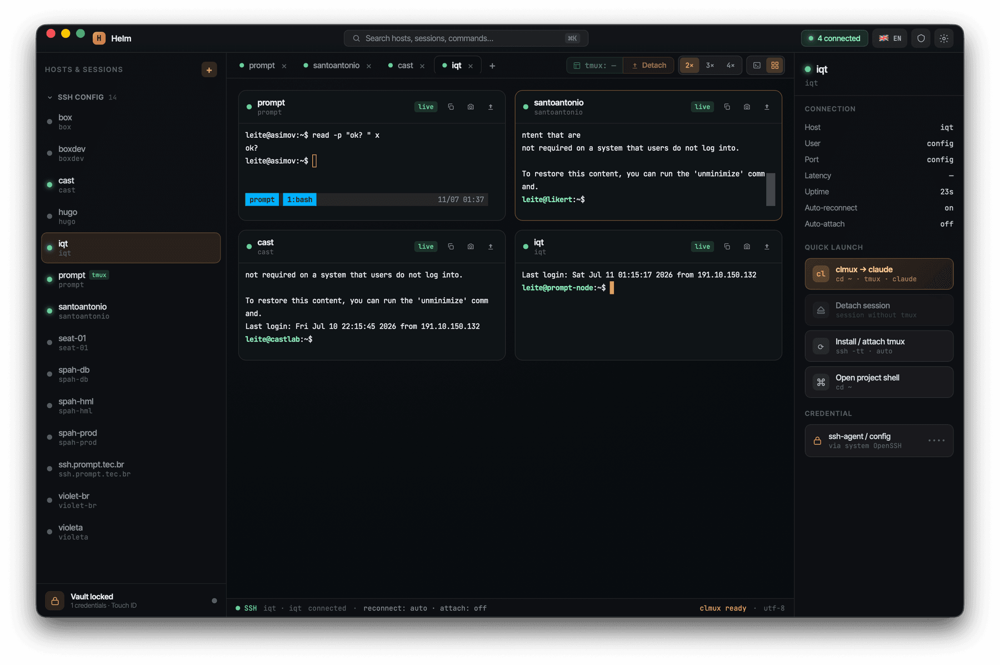
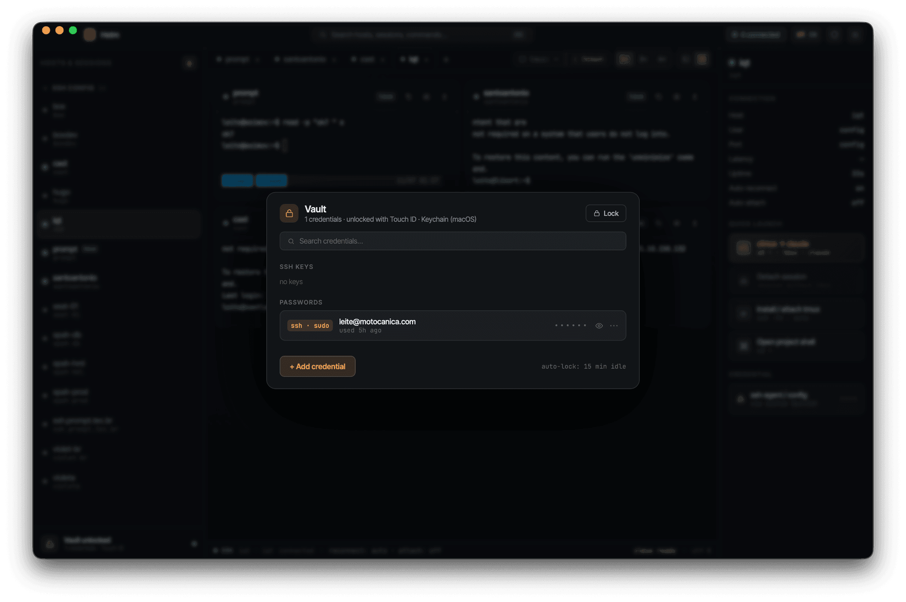
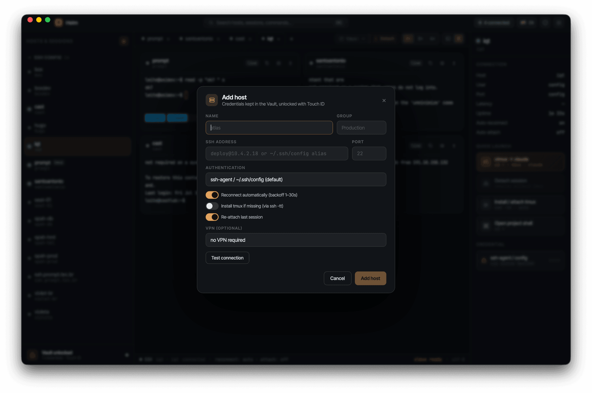
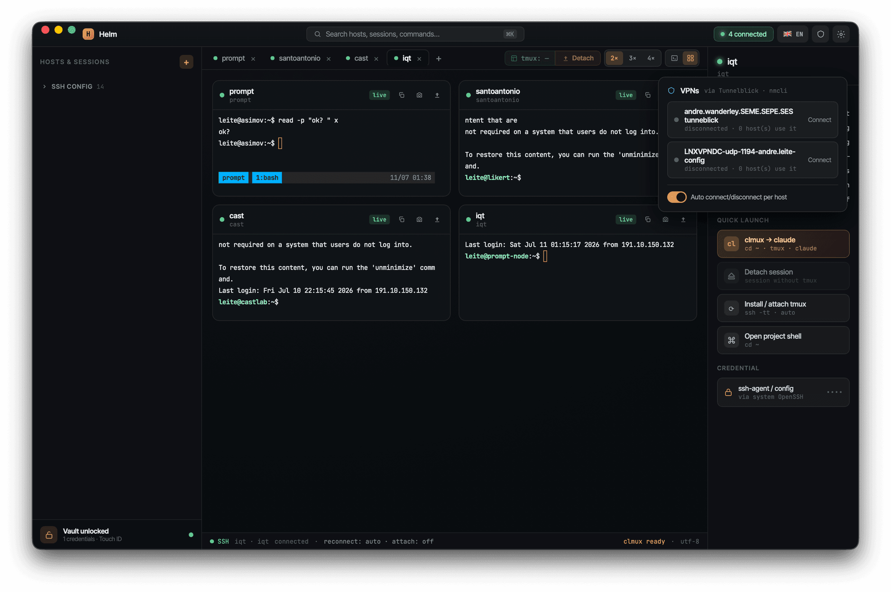

# Helm

[](https://doi.org/10.5281/zenodo.21303523)
[](https://github.com/milkway/helm/releases)
[](LICENSE)

**Desktop SSH terminal manager for macOS and Linux.** Persistent per-project tmux sessions, automatic reconnect and re-attach, a native credential vault (Keychain/Secret Service with Touch ID), VPN integration, and the **clmux** quick-launch — cd into the project folder and open Claude inside tmux in one click.

**🌐 Website:** [milkway.github.io/helm](https://milkway.github.io/helm/) · **⬇ Download:** [Releases](https://github.com/milkway/helm/releases)

## Interface

| Terminal mode | Grid mode |
|---|---|
|  |  |

| Vault (Touch ID) | Add host | VPN |
|---|---|---|
|  |  |  |

## Features

- **Persistent SSH sessions** via the system OpenSSH (`ssh -tt`), inheriting the agent, `~/.ssh/config` and ProxyCommand.
- **Per-project tmux** with auto-attach and **Detach** that keeps the session running on the server.
- **Auto-reconnect** with exponential backoff (1–30s, 5 tries) and an error screen with automatic retry.
- **Grid mode** with live terminals, 2×/3×/4× density and capture (copy output / PNG per card).
- **Vault** for credentials in the Keychain (macOS, with Touch ID) / Secret Service (Linux); only metadata in SQLite — the secret never touches disk.
- **Attention detection** — highlights background sessions waiting for user input.
- **⌘K command palette**, `~/.ssh/config` import and **clmux** (opens Claude inside tmux).
- **VPN integration** (Tunnelblick on macOS, `nmcli` on Linux): connects before SSH and disconnects when the last host using it closes.
- **Multi-language UI** — English, Portuguese, French and Spanish, defaulting to your system language.

## Installation

Download the installer for your platform from **[Releases](https://github.com/milkway/helm/releases/latest)**:

| Platform | File |
|---|---|
| macOS · Apple Silicon | `Helm_x.y.z_aarch64.dmg` |
| macOS · Intel | `Helm_x.y.z_x64.dmg` |
| Linux · Debian/Ubuntu | `Helm_x.y.z_amd64.deb` |

On macOS the credential vault uses Touch ID; on Linux, the session's Secret Service.

## Development

```bash
npm install
npm run tauri dev
```

**Build installers:**
- **macOS (`.dmg`):** `npm run tauri build`
- **Linux (`.deb`):** `scripts/build-deb-remote.sh` (over SSH on an Ubuntu machine) or `scripts/build-deb.sh` (Docker)

**Release:** pushing a `vX.Y.Z` tag triggers the `release.yml` workflow (`.dmg` for macOS aarch64 + x86_64 and `.deb` for Ubuntu 22.04 via `tauri-action`). CI (`ci.yml`) runs typecheck, build and `cargo clippy` on every push/PR.

## Stack

- **App:** Tauri 2 · React 19 · TypeScript 6 · Vite 8 · Zustand 5
- **Terminal:** `@xterm/xterm` 6 (+ fit/webgl addons)
- **Backend (Rust):** `portable-pty` (orchestrates the system OpenSSH), `keyring`, `rusqlite`, `tokio`

## Citation

If this software is useful in your work, please cite it via [`CITATION.cff`](CITATION.cff) or by the DOI **[10.5281/zenodo.21303523](https://doi.org/10.5281/zenodo.21303523)**.

## License

[MIT](LICENSE) © 2026 André Leite
