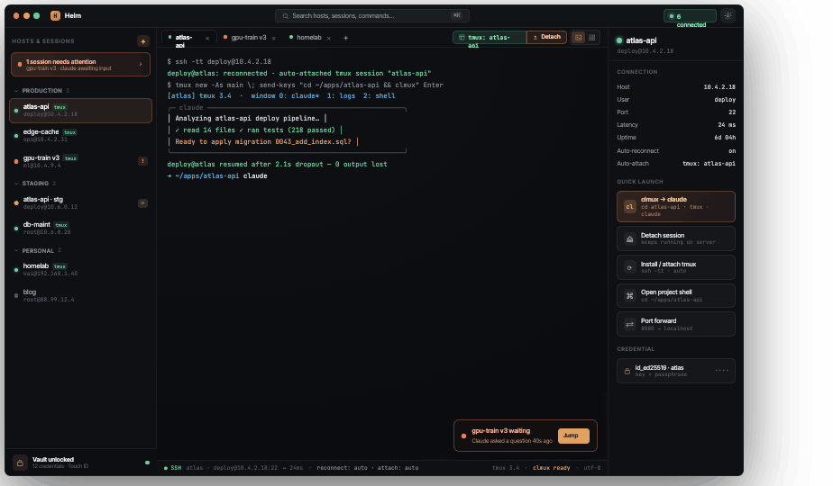
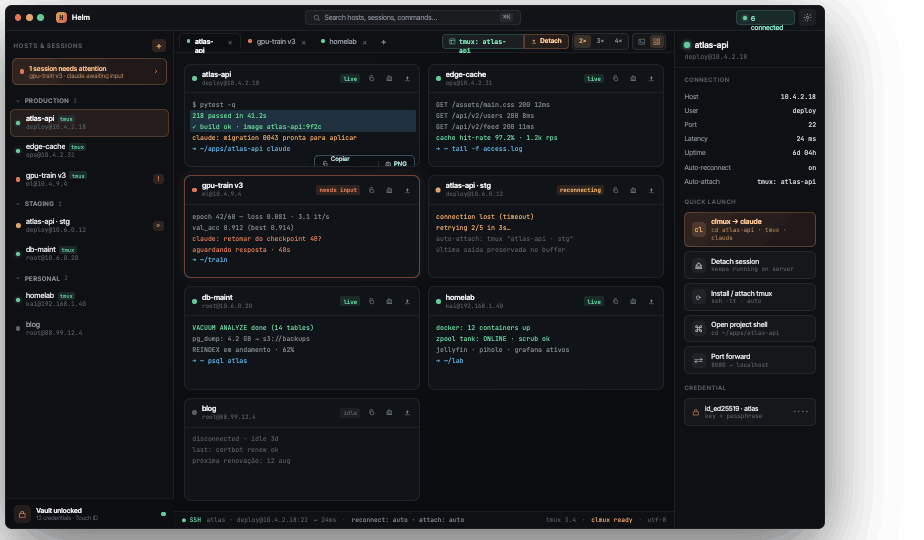
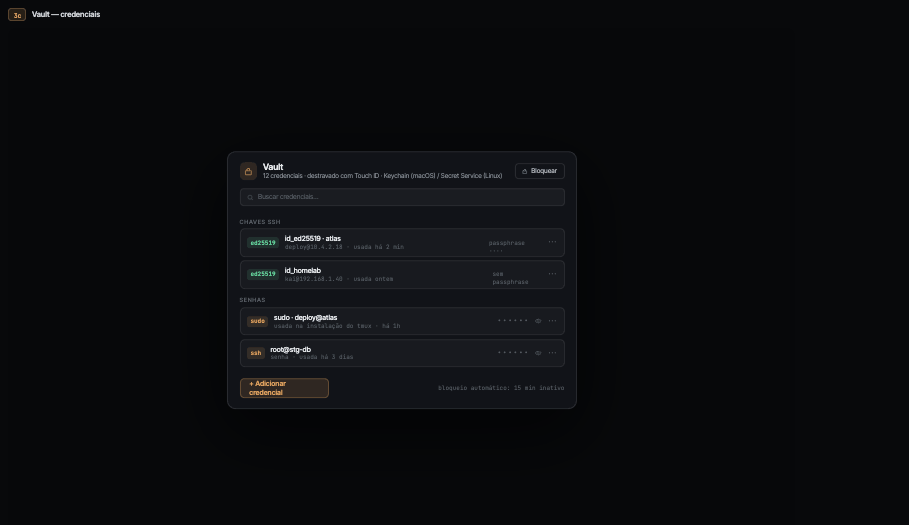
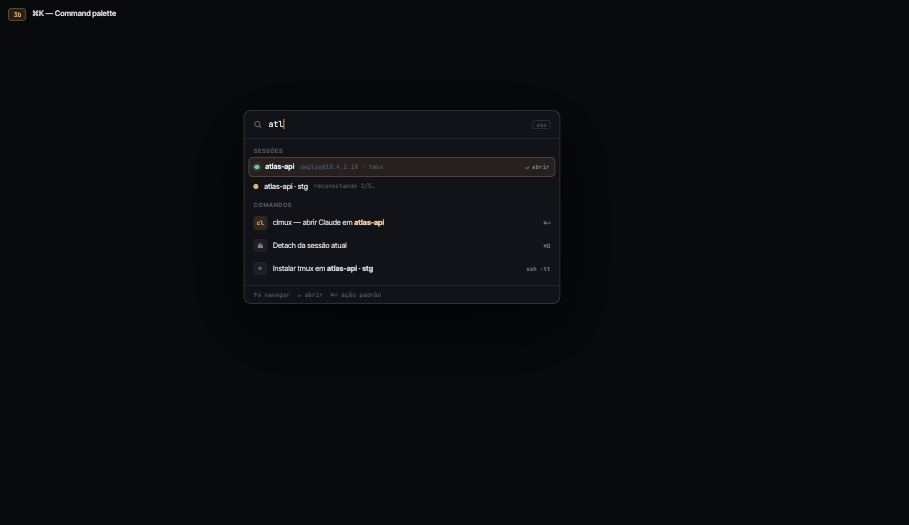
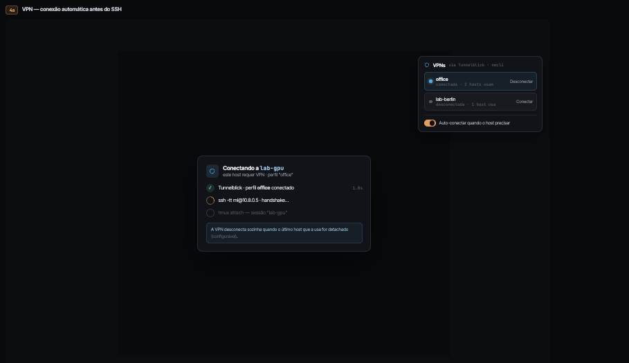

# Helm

Gerenciador desktop de terminais SSH (macOS + Linux) construído com Tauri 2 + React 19 + xterm.js 6.

Sessões tmux persistentes por projeto, reconexão e re-attach automáticos, cofre de credenciais nativo (Keychain/Secret Service + Touch ID), integração VPN (Tunnelblick/nmcli) e quick-launch **clmux** — entra na pasta do projeto e abre o Claude dentro do tmux com um clique.

## Interface

| Modo terminal | Modo grid |
|---|---|
|  |  |

| Vault (Touch ID) | Command palette (⌘K) | VPN |
|---|---|---|
|  |  |  |

## Recursos

- **Sessões SSH persistentes** via OpenSSH do sistema (`ssh -tt`), herdando agent, `~/.ssh/config` e ProxyCommand.
- **tmux por projeto** com auto-attach e **Detach** que preserva a sessão no servidor.
- **Auto-reconnect** com backoff exponencial (1–30s, 5 tentativas) e tela de erro com retry automático.
- **Modo grid** com terminais vivos, densidade 2×/3×/4× e captura (copiar saída / PNG).
- **Vault** de credenciais no Keychain (macOS, com Touch ID) / Secret Service (Linux); só metadados no SQLite.
- **Detecção de atenção**: destaca sessões aguardando input do usuário.
- **⌘K command palette**, importação de `~/.ssh/config` e **clmux** (abre o Claude dentro do tmux).
- **Integração VPN** (Tunnelblick no macOS, nmcli no Linux): conecta antes do SSH e desconecta quando o último host que a usa fecha.

## Status

Primeiro release: **v0.1.0**. Instaladores `.dmg` e `.deb` em [Releases](https://github.com/milkway/helm/releases). Plano de implementação em [PLANO.md](PLANO.md).

## Design

O pacote de design (protótipos HTML hifi, fonte da verdade visual) está em [`design_handoff_helm/`](design_handoff_helm/) — comece pelo [README do handoff](design_handoff_helm/README.md).

## Stack

- **App:** Tauri 2.x · React 19.2 · TypeScript ~6.0 · Vite 8.1 · Zustand 5
- **Terminal:** `@xterm/xterm` 6 + addons fit/webgl
- **Backend (Rust):** `portable-pty` (orquestra o OpenSSH do sistema via `ssh -tt`), `keyring`, `rusqlite`, `tokio`
- **Distribuição:** `.dmg` (macOS) e `.deb` (Linux) via GitHub Actions

## Build e release

**Dev:** `npm install` e `npm run tauri dev`.

**Instaladores locais:**
- **.dmg (macOS):** `npm run tauri build` → `src-tauri/target/release/bundle/dmg/`. No bundle assinado o Vault usa Touch ID real (em `tauri dev` a biometria é pulada, pois o binário solto não a apresenta).
- **.deb (Linux):** `scripts/build-deb-remote.sh` (compila na máquina `prompt`, Ubuntu 22.04) ou `scripts/build-deb.sh` (Docker).

**Release automático:** empurrar uma tag `vX.Y.Z` dispara o workflow `release.yml`, que gera `.dmg` (macOS aarch64 + x86_64) e `.deb` (Ubuntu 22.04) via `tauri-action` e publica um release draft com os instaladores. O CI (`ci.yml`) roda typecheck, build e `cargo clippy` em cada push/PR.

## Licença

MIT
